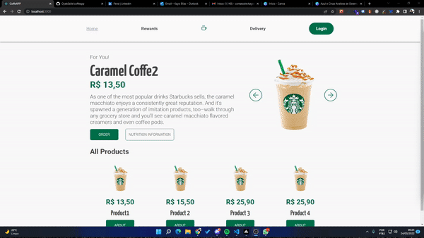

# CoffeAPP

 App para Estudos

Normalmente eu Utilizo Branchs, pulls Request e tudo que o GitHub oferece, mas esse projeto é pra estudo então eu foquei mais em fazer funcionar e ir guardando = )

<ul>
  Tecnologias Utilizadas
  <li>ReactJS</li>
  <li>TypeScript</li>
  <li>Styled Components</li>
  <li>MirageJS</li>
  <li>React Animations</li>
  <li>Pallete</li>
</ul>

